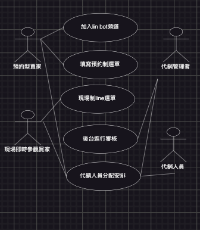
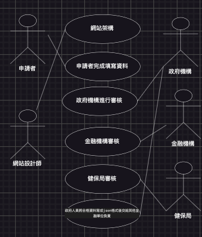

# 期中考-期中-Mid 
<!--(期中標籤註記，該行不能刪，作為驗證標籤，該檔案若沒該份標籤，代表直接貼上saample，直接0分)-->

>
>學號：111111117
> 
>姓名：林郁岑
> 

本份文件包含以下主題：(至少需下面兩項，若是有多者可以自行新增)
- [x] 答題

## 答題
 

(a)
| 利害關係人 | 目標 |
| ---- | ---- | 
| 代銷公司 |透過軟體提高房屋銷售率 | 
| 代銷人員| 透過軟體接待預約型買家和即時參觀行買家 |
| 代銷管理者| 透過軟體安排代銷人員 |
| 預約型買家| 透管軟體預約並獲和即時安排 |
| 代現場參觀即時買家| 透過軟體即時參觀房屋 |

(b)
使用案例圖
 </img>

 

(c)
案例1
| 案例名稱 | 軟體設計 |
| ---- | ---- | 
| 使用案例 |透過設計一款軟體能有效地接待預約行買家和現場即時參觀買家 |
| 主要參與者 |代銷公司、軟體設計團隊 |
| 利害關係人 |代銷公司 |
| 目標 |藉由軟體設計有效地接待預約行買家和即時參觀買家 |
| 前置條件 |銷公司需提供清晰的功能期望、功能需求等 |
| 後置條件|軟體設計完成且通過測試   |
| 主要成功情節 |軟體能夠準確地接收和處理預約型買家和即時參觀買家的申請 |
 

案例2
| 案例名稱 | 軟體效用 |
| ---- | ---- | 
| 使用案例 |透過軟體接待買家，並降低代銷人員疏失，進而提升服務品質 |
| 主要參與者 |代銷公司、軟體設計團隊 |
| 利害關係人 |代銷公司，買家 |
| 目標 |藉由軟體設計提申接待效率 |
| 前置條件 |軟體設計團隊需具有相關的技術和經驗 |
| 後置條件|代銷公司和買家能夠順利使用軟體進行接待服務   |
| 主要成功情節 |買家能夠獲得準確、即時的接待安排 |

 

案例3
| 案例名稱 | 買家使用軟體進行申請 |
| ---- | ---- | 
| 使用案例 |預約行買家須於到達接待中心前48小時填寫申請，現場即時參觀買家則無法選擇時段 |
| 主要參與者 |預約型買家、現場即時參觀買家 |
| 利害關係人 |代銷公司、代銷管理者 |
| 目標 |能夠有效地管理預約型買家和現場即時參觀買家的安排，提高接待效率 |
| 前置條件 |軟體設計團隊具有相關的技術能力和經驗，設計出符合前後台的軟體 |
| 後置條件|買家能夠順利使用前臺軟體進行申請 |
| 主要成功情節 |買家能夠順利完成申請並獲得及時的反饋 |

 

案例4
| 案例名稱 | 後台申請審核 |
| ---- | ---- | 
| 使用案例 |後台審核申請人預約時間，若時段有衝突則通知買家重新選擇。|
| 主要參與者 |預約型買家、代銷管理者 |
| 利害關係人 |代銷公司，預約型買家 |
| 目標 |期望能夠順利完成申請，得到確認並在預約日期和時段接受服務。 |
| 前置條件 |需要一個具有填寫功能的申請表單，並查詢預約時段是否有被選取 |
| 後置條件| 代銷管理者成功完成時程安排和代銷人員分配 |
| 主要成功情節 | 若預約成功則會發送預約成功的訊息/預約失敗則會送預約失敗的訊息/若無法預約則會重新傳送預約申請表單|

 

案例1
| 案例名稱 | 代銷人員分配 |
| ---- | ---- | 
| 使用案例 |台根據申請進行時程安排和代銷人員|
| 主要參與者 |代銷管理者、買家 |
| 利害關係人 |代銷公司、買家 |
| 目標 |期望能夠在指定的時段得到預約接待」 |
| 前置條件 |買家成功填寫申請信息 |
| 後置條件| 代銷人員成功接收到申請信息並進行接待 |
| 主要成功情節 | 代銷人員成功分配並接待買家，買家滿意並完成房屋購買流程。|

(d)

>2. 

(a)
| 利害關係人 | 目標 |
| ---- | ---- | 
| 申請者 |能夠順利申請到發放的金額  | 
| 設計失 |設計一個能讓申請者順利領到發放金額的網站  |
| 政府機關人員| 確保政策順利實施，提高民眾滿意度      |
| 健保局| 透過與政府合作，提高健保局資料核對的效率 |
| 金融機構| 透確保提供給政府的資訊準確無誤，確保合格申請者能夠順利獲得發放金額 |

(b)
使用案例圖
</img>

(c)
 
案例1
| 案例名稱 | 進入申請網頁 |
| ---- | ---- | 
| 使用案例 |申請人進入網站進行資料登記並提交申請 |
| 主要參與者 |申請者 |
| 利害關係人 |申請者、政府 |
| 目標 |提供一個網站供申請者進行資料登記 |
| 前置條件 |網站設計師需了解申請流程和相關需求 |
| 後置條件| 申請人成功填寫資料並送出申請 |
| 主要成功情節 | 申請人能順利進入網站進行申請並填寫完畢所需的資料|

 

案例2
| 案例名稱 | 政府機構資料審核 |
| ---- | ---- | 
| 使用案例 |政府人員對申請者資料進行審核 |
| 主要參與者 |政府人員 |
| 利害關係人 |申請者、政府 |
| 目標 |審核申請者的資料，確保其符合領取 8000 元的資格|
| 前置條件 |政府人員需要正確的後台系統，能夠接收並顯示申請者的資料 |
| 後置條件| 政府人員根據後台系統顯示的申請者資料進行審核 |
| 主要成功情節 | 後台系統能夠成功更新申請者的狀態|

 

案例3
| 案例名稱 | 金融機構資料審核 |
| ---- | ---- | 
| 使用案例 |將申請者的身分證字號或居留證號傳至申請者所填的第三方金融機構進行比對資訊 |
| 主要參與者 |金融機構 |
| 利害關係人 |申請者、金融機構 |
| 目標 |確認申請者的身份資訊的正確性和真實性|
| 前置條件 |申請者須正確填寫身份資料 |
| 後置條件| 金融機構將收到的身份資訊與其資料庫中的資料進行比對。|
| 主要成功情節 | 如果比對成功，則金融機構返回一致性的結果|

 

案例4
| 案例名稱 | 健保局資料審核 |
| ---- | ---- | 
| 使用案例 |將申請人的健保卡號至健保局確認 |
| 主要參與者 |健保局|
| 利害關係人 |申請者、健保局 |
| 目標 |確認申請者提供的健保卡號在健保局中的有效性和正確性|
| 前置條件 |申請者需要在申請表格中提供正確的健保卡號 |
| 後置條件| 政府人員收到健保局返回的確認結果後，根據結果繼續處理申請流程 |
| 主要成功情節 | 如果健保卡號在健保局的資料庫中找到，則返回一致性的結果|

 

案例5
| 案例名稱 | 資料合格 |
| ---- | ---- | 
| 使用案例 |政府人員將合格資料寫入 JSON 格式，以便之後交給其他金融負責單位。 |
| 主要參與者 |政府人員|
| 利害關係人 |政府人員、其他金融單位 |
| 目標 |將合格資料轉換成 JSON 格式，並準確地傳遞給其他金融負責單位|
| 前置條件 |政府人員需要了解如何將資料轉換成 JSON 格式 |
| 後置條件| 合格資料成功轉換成 JSON 格式後，可以順利傳遞給其他金融負責單位 |
| 主要成功情節 | 申請者正確填入所有資訊|

(d)

